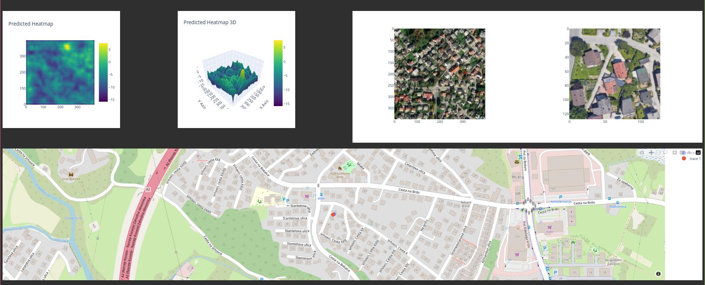
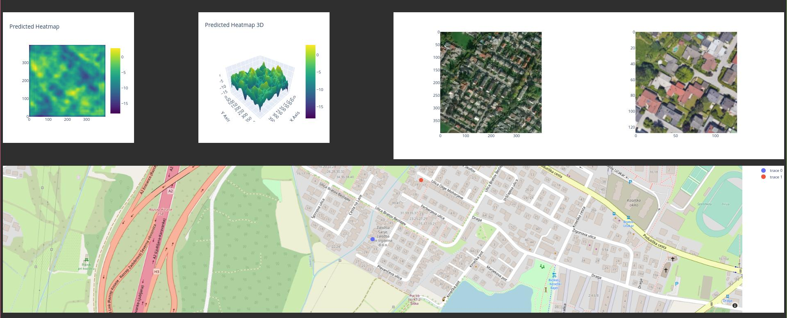

# Custom Twins transformer for Multi-View Image Fusion
This repository contains a custom Vision Transformer model, designed to handle multi-view image fusion. 
The model is tasked with merging the features from Unmanned Aerial Vehicle (UAV) and satellite images.
The model uses a modified version of the PCPVT (pyramid vision transformer) model that has been pretrained on ResNet50 for feature extraction 
from both UAV and satellite images. These extracted features are then combined using a custom fusion module. 
This module operates in multiple stages and balances the contributions from each image source.

## Getting Started
Follow these steps to set up the environment and start training the model.

1. Create a Python virtual environment.
    ```bash
    python3 -m venv .venv
    ```
2. Activate the virtual environment.
    ```bash
    . .venv/bin/activate
    ```
3. Install the required dependencies.
    ```bash
    make install-requirements
    ```
4. Modify the `./conf/configuration.template.yaml` to adjust parameters for training. 
    ```bash
    cp ./conf/configuration.template.yaml ./conf/configuration.yaml
    ```
5. Train the model.
    ```bash
    make train
    ```
6. Validate the model.
    ```bash
    make val
    ```
Note: You can modify the `conf/configuration.yml` file for hyperparameter tuning as per your requirement.
Note: Dataset is currently unavailable.

## Examples

### Example of good localization


### Example of poor localization


## Model Architecture

### Goal modified Twins backbone (to extract features for fusion)

```python
Twins(
  (patch_embeds): ModuleList(
    (0): PatchEmbed(
      (proj): Conv2d(3, 64, kernel_size=(4, 4), stride=(4, 4))
      (norm): LayerNorm((64,), eps=1e-05, elementwise_affine=True)
    )
    (1): PatchEmbed(
      (proj): Conv2d(64, 128, kernel_size=(2, 2), stride=(2, 2))
      (norm): LayerNorm((128,), eps=1e-05, elementwise_affine=True)
    )
    (2): PatchEmbed(
      (proj): Conv2d(128, 320, kernel_size=(2, 2), stride=(2, 2))
      (norm): LayerNorm((320,), eps=1e-05, elementwise_affine=True)
    )
    (3): Identity()
  )
  (pos_drops): ModuleList(
    (0-3): 4 x Dropout(p=0.0, inplace=False)
  )
  (blocks): ModuleList(
    (0): ModuleList(
      (0-2): 3 x Block(
        (norm1): LayerNorm((64,), eps=1e-06, elementwise_affine=True)
        (attn): GlobalSubSampleAttn(
          (q): Linear(in_features=64, out_features=64, bias=True)
          (kv): Linear(in_features=64, out_features=128, bias=True)
          (attn_drop): Dropout(p=0.0, inplace=False)
          (proj): Linear(in_features=64, out_features=64, bias=True)
          (proj_drop): Dropout(p=0.0, inplace=False)
          (sr): Conv2d(64, 64, kernel_size=(8, 8), stride=(8, 8))
          (norm): LayerNorm((64,), eps=1e-05, elementwise_affine=True)
        )
        (drop_path1): Identity()
        (norm2): LayerNorm((64,), eps=1e-06, elementwise_affine=True)
        (mlp): Mlp(
          (fc1): Linear(in_features=64, out_features=512, bias=True)
          (act): GELU(approximate='none')
          (drop1): Dropout(p=0.0, inplace=False)
          (norm): Identity()
          (fc2): Linear(in_features=512, out_features=64, bias=True)
          (drop2): Dropout(p=0.0, inplace=False)
        )
        (drop_path2): Identity()
      )
    )
    (1): ModuleList(
      (0-3): 4 x Block(
        (norm1): LayerNorm((128,), eps=1e-06, elementwise_affine=True)
        (attn): GlobalSubSampleAttn(
          (q): Linear(in_features=128, out_features=128, bias=True)
          (kv): Linear(in_features=128, out_features=256, bias=True)
          (attn_drop): Dropout(p=0.0, inplace=False)
          (proj): Linear(in_features=128, out_features=128, bias=True)
          (proj_drop): Dropout(p=0.0, inplace=False)
          (sr): Conv2d(128, 128, kernel_size=(4, 4), stride=(4, 4))
          (norm): LayerNorm((128,), eps=1e-05, elementwise_affine=True)
        )
        (drop_path1): Identity()
        (norm2): LayerNorm((128,), eps=1e-06, elementwise_affine=True)
        (mlp): Mlp(
          (fc1): Linear(in_features=128, out_features=1024, bias=True)
          (act): GELU(approximate='none')
          (drop1): Dropout(p=0.0, inplace=False)
          (norm): Identity()
          (fc2): Linear(in_features=1024, out_features=128, bias=True)
          (drop2): Dropout(p=0.0, inplace=False)
        )
        (drop_path2): Identity()
      )
    )
    (2): ModuleList(
      (0-5): 6 x Block(
        (norm1): LayerNorm((320,), eps=1e-06, elementwise_affine=True)
        (attn): GlobalSubSampleAttn(
          (q): Linear(in_features=320, out_features=320, bias=True)
          (kv): Linear(in_features=320, out_features=640, bias=True)
          (attn_drop): Dropout(p=0.0, inplace=False)
          (proj): Linear(in_features=320, out_features=320, bias=True)
          (proj_drop): Dropout(p=0.0, inplace=False)
          (sr): Conv2d(320, 320, kernel_size=(2, 2), stride=(2, 2))
          (norm): LayerNorm((320,), eps=1e-05, elementwise_affine=True)
        )
        (drop_path1): Identity()
        (norm2): LayerNorm((320,), eps=1e-06, elementwise_affine=True)
        (mlp): Mlp(
          (fc1): Linear(in_features=320, out_features=1280, bias=True)
          (act): GELU(approximate='none')
          (drop1): Dropout(p=0.0, inplace=False)
          (norm): Identity()
          (fc2): Linear(in_features=1280, out_features=320, bias=True)
          (drop2): Dropout(p=0.0, inplace=False)
        )
        (drop_path2): Identity()
      )
    )
  )
  (pos_block): ModuleList(
    (0): PosConv(
      (proj): Sequential(
        (0): Conv2d(64, 64, kernel_size=(3, 3), stride=(1, 1), padding=(1, 1), groups=64)
        (save_l0): SaveLayerFeatures()
      )
    )
    (1): PosConv(
      (proj): Sequential(
        (0): Conv2d(128, 128, kernel_size=(3, 3), stride=(1, 1), padding=(1, 1), groups=128) # DO the same thing in  the fusion layer
        (save_l1): SaveLayerFeatures()
      )
    )
    (2): PosConv(
      (proj): Sequential(
        (0): Conv2d(320, 320, kernel_size=(3, 3), stride=(1, 1), padding=(1, 1), groups=320)
        (save_l2): SaveLayerFeatures()
      )
    )
    (3): Identity()
  )
  (norm): Identity()
  (head_drop): Dropout(p=0.0, inplace=False)
  (head): Identity()
)
```
