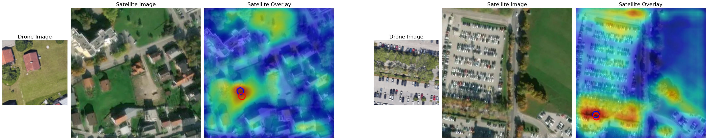
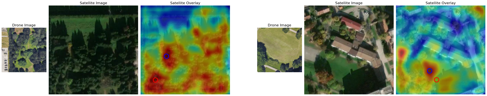

# Custom Twins transformer for Multi-View Image Fusion

In this repository, we have focused on a approach to multi-view image fusion from Unmanned Aerial Vehicle (UAV) and satellite imagery. 
Recognizing the significant advancements and potential of the [WAMF-FPI](https://www.mdpi.com/2072-4292/15/4/910) method, 
we have adopted it as the foundation for our implementation, making it the first of its kind to be publicly accessible.

Our adaptation does not merely replicate the original method but enhances its capabilities. 
Key technical improvements have been integrated, most notably the inclusion of ReLU and Batch Normalization within the fusion module. 
To further enhance the robustness of our approach, we've integrated dropouts during the feature extraction process, 
ensuring that the model is both efficient and resilient against potential overfitting.

Central to our methodology is the custom Vision Transformer model. 
This model is an extension of the well-established PCPVT (pyramid vision transformer) that has been pretrained on the ResNet50 dataset. 
The primary role of this model is to extract features from both UAV and satellite data sources. 

## Model Architecture


## Getting Started
Follow these steps to set up the environment and start training the model.

1. Create a Python virtual environment.
    ```bash
    python3 -m venv .venv
    ```
2. Activate the virtual environment.
    ```bash
    . .venv/bin/activate
    ```
3. Install the required dependencies.
    ```bash
    make install-requirements
    ```
4. Modify the `./conf/configuration.template.yaml` to adjust parameters for training. 
    ```bash
    cp ./conf/configuration.template.yaml ./conf/configuration.yaml
    ```
5. Train the model.
    ```bash
    make train
    ```
6. Validate the model.
    ```bash
    make val
    ```
Note: You can modify the `conf/configuration.yml` file for hyperparameter tuning as per your requirement.
Note: Dataset is currently unavailable.

## Examples

### Example of good localization
Residential house in a housing estate with an error of 6.93m and RDS value of 0.90. On the right, a parking lot in a monotone environment with an error of 3.77m and RDS value of 0.94.

Section of the highway with an error of 6.55m and RDS value of 0.91. On the right, vicinity of a residential house in an estate with an error of 5.73m and RDS value of 0.90.

Industrial building in an industrial zone with an error of 3.99m and RDS value of 0.95. On the right, meadow by residential houses with an error of 2.07m and RDS value of 0.97.


### Example of poor localization
Both images show meadows and trees. Left image has an error of 50.74m with RDS value of 0.31, right has 30.16m with RDS value of 0.42.

Residential house overlaid by a cloud on the satellite image with an error of 54.24m and RDS value of 0.30. On the right, industrial building in a monotone industrial zone with an error of 150.47m and RDS value of 0.10.

Construction site present in the drone image but absent in the satellite one with an error of 169.43m and RDS value of 0.09. On the right, a field in a monotone setting with an error of 155.47m and RDS value of 0.10.


## Backbone Architecture

### Goal modified Twins backbone (to extract features for fusion)

```python
Twins(
  (patch_embeds): ModuleList(
    (0): PatchEmbed(
      (proj): Conv2d(3, 64, kernel_size=(4, 4), stride=(4, 4))
      (norm): LayerNorm((64,), eps=1e-05, elementwise_affine=True)
    )
    (1): PatchEmbed(
      (proj): Conv2d(64, 128, kernel_size=(2, 2), stride=(2, 2))
      (norm): LayerNorm((128,), eps=1e-05, elementwise_affine=True)
    )
    (2): PatchEmbed(
      (proj): Conv2d(128, 320, kernel_size=(2, 2), stride=(2, 2))
      (norm): LayerNorm((320,), eps=1e-05, elementwise_affine=True)
    )
    (3): Identity()
  )
  (pos_drops): ModuleList(
    (0-3): 4 x Dropout(p=0.0, inplace=False)
  )
  (blocks): ModuleList(
    (0): ModuleList(
      (0-2): 3 x Block(
        (norm1): LayerNorm((64,), eps=1e-06, elementwise_affine=True)
        (attn): GlobalSubSampleAttn(
          (q): Linear(in_features=64, out_features=64, bias=True)
          (kv): Linear(in_features=64, out_features=128, bias=True)
          (attn_drop): Dropout(p=0.0, inplace=False)
          (proj): Linear(in_features=64, out_features=64, bias=True)
          (proj_drop): Dropout(p=0.0, inplace=False)
          (sr): Conv2d(64, 64, kernel_size=(8, 8), stride=(8, 8))
          (norm): LayerNorm((64,), eps=1e-05, elementwise_affine=True)
        )
        (drop_path1): Identity()
        (norm2): LayerNorm((64,), eps=1e-06, elementwise_affine=True)
        (mlp): Mlp(
          (fc1): Linear(in_features=64, out_features=512, bias=True)
          (act): GELU(approximate='none')
          (drop1): Dropout(p=0.0, inplace=False)
          (norm): Identity()
          (fc2): Linear(in_features=512, out_features=64, bias=True)
          (drop2): Dropout(p=0.0, inplace=False)
        )
        (drop_path2): Identity()
      )
    )
    (1): ModuleList(
      (0-3): 4 x Block(
        (norm1): LayerNorm((128,), eps=1e-06, elementwise_affine=True)
        (attn): GlobalSubSampleAttn(
          (q): Linear(in_features=128, out_features=128, bias=True)
          (kv): Linear(in_features=128, out_features=256, bias=True)
          (attn_drop): Dropout(p=0.0, inplace=False)
          (proj): Linear(in_features=128, out_features=128, bias=True)
          (proj_drop): Dropout(p=0.0, inplace=False)
          (sr): Conv2d(128, 128, kernel_size=(4, 4), stride=(4, 4))
          (norm): LayerNorm((128,), eps=1e-05, elementwise_affine=True)
        )
        (drop_path1): Identity()
        (norm2): LayerNorm((128,), eps=1e-06, elementwise_affine=True)
        (mlp): Mlp(
          (fc1): Linear(in_features=128, out_features=1024, bias=True)
          (act): GELU(approximate='none')
          (drop1): Dropout(p=0.0, inplace=False)
          (norm): Identity()
          (fc2): Linear(in_features=1024, out_features=128, bias=True)
          (drop2): Dropout(p=0.0, inplace=False)
        )
        (drop_path2): Identity()
      )
    )
    (2): ModuleList(
      (0-5): 6 x Block(
        (norm1): LayerNorm((320,), eps=1e-06, elementwise_affine=True)
        (attn): GlobalSubSampleAttn(
          (q): Linear(in_features=320, out_features=320, bias=True)
          (kv): Linear(in_features=320, out_features=640, bias=True)
          (attn_drop): Dropout(p=0.0, inplace=False)
          (proj): Linear(in_features=320, out_features=320, bias=True)
          (proj_drop): Dropout(p=0.0, inplace=False)
          (sr): Conv2d(320, 320, kernel_size=(2, 2), stride=(2, 2))
          (norm): LayerNorm((320,), eps=1e-05, elementwise_affine=True)
        )
        (drop_path1): Identity()
        (norm2): LayerNorm((320,), eps=1e-06, elementwise_affine=True)
        (mlp): Mlp(
          (fc1): Linear(in_features=320, out_features=1280, bias=True)
          (act): GELU(approximate='none')
          (drop1): Dropout(p=0.0, inplace=False)
          (norm): Identity()
          (fc2): Linear(in_features=1280, out_features=320, bias=True)
          (drop2): Dropout(p=0.0, inplace=False)
        )
        (drop_path2): Identity()
      )
    )
  )
  (pos_block): ModuleList(
    (0): PosConv(
      (proj): Sequential(
        (0): Conv2d(64, 64, kernel_size=(3, 3), stride=(1, 1), padding=(1, 1), groups=64)
        (save_l0): SaveLayerFeatures()
      )
    )
    (1): PosConv(
      (proj): Sequential(
        (0): Conv2d(128, 128, kernel_size=(3, 3), stride=(1, 1), padding=(1, 1), groups=128) # DO the same thing in  the fusion layer
        (save_l1): SaveLayerFeatures()
      )
    )
    (2): PosConv(
      (proj): Sequential(
        (0): Conv2d(320, 320, kernel_size=(3, 3), stride=(1, 1), padding=(1, 1), groups=320)
        (save_l2): SaveLayerFeatures()
      )
    )
    (3): Identity()
  )
  (norm): Identity()
  (head_drop): Dropout(p=0.0, inplace=False)
  (head): Identity()
)
```
